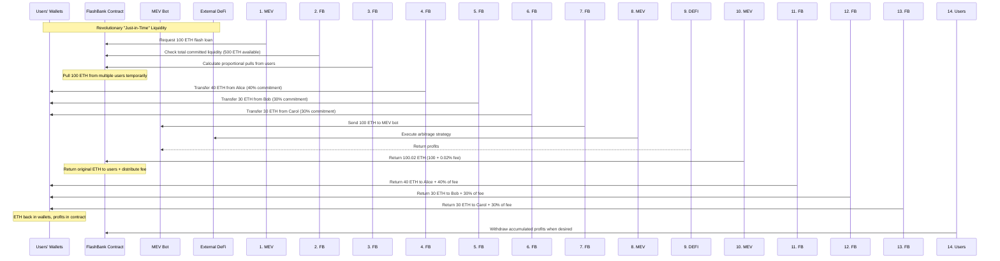

# FlashBank Correct Architecture - Revolutionary Design

## 🚨 Current Problem
The existing contract implements a traditional deposit pool, but FlashBank should be a "just-in-time" liquidity system where ETH stays in users' wallets.

## 🎯 Correct FlashBank Concept

### The Revolutionary Idea
```
Users' ETH stays in their own wallets
↓
Contract has approval to temporarily borrow ETH
↓
During flash loan: Pull only what's needed from multiple accounts  
↓
After flash loan: Return original ETH to users automatically
↓
Only profits stay in contract for distribution
```

## 🏗️ Required Contract Architecture

### Core Components Needed

```solidity
contract FlashBankCorrect {
    // Track user approvals and commitments
    mapping(address => uint256) public userCommittedAmount;
    mapping(address => uint256) public userProfitBalance;
    
    // For efficient liquidity calculations
    uint256 public totalCommittedLiquidity;
    address[] public liquidityProviders;
    
    // Approve liquidity commitment (like ERC20 approval)
    function commitLiquidity(uint256 amount) external {
        // User approves contract to use their ETH up to amount
        // ETH stays in user's wallet
    }
    
    // Flash loan function - pulls from multiple accounts
    function flashLoan(uint256 amount, bytes calldata data) external {
        // 1. Check total available liquidity
        // 2. Calculate which users to pull from and how much
        // 3. Temporarily transfer ETH from multiple users
        // 4. Execute flash loan strategy
        // 5. Return original ETH to each user
        // 6. Distribute profits proportionally
    }
    
    // Users only withdraw profits, not their "deposits"
    function withdrawProfits() external {
        // User gets their accumulated fees
        // Their committed ETH stays in their wallet
    }
}
```

## 🔍 Flash Loan Execution Flow

### Step-by-Step Process



## 💡 Why This is Revolutionary

### Traditional DeFi vs True FlashBank


## 🔧 Implementation Challenges

### Technical Requirements

1. **Multi-User Transfers**
   - Pull from multiple accounts proportionally
   - Gas optimization for many transfers
   - Atomic execution (all or nothing)

2. **Approval System**
   - Like ERC20 approvals but for ETH
   - Track commitments vs actual balances
   - Handle approval changes

3. **Proportional Calculations**
   - Determine which users to pull from
   - Calculate exact amounts needed
   - Handle edge cases (insufficient balance)

4. **Gas Optimization**
   - Minimize transfer count
   - Batch operations where possible
   - Efficient profit distribution

### Pseudo-Code for Flash Loan

```solidity
function flashLoan(uint256 amount, bytes calldata data) external {
    require(amount <= totalCommittedLiquidity, "Insufficient liquidity");
    
    // Calculate proportional pulls
    UserPull[] memory pulls = calculatePulls(amount);
    
    // Pull ETH from users temporarily
    for (uint i = 0; i < pulls.length; i++) {
        require(pulls[i].user.balance >= pulls[i].amount, "User insufficient balance");
        payable(address(this)).call{value: pulls[i].amount}("");
    }
    
    // Execute flash loan
    payable(msg.sender).call{value: amount}("");
    bool success = IL2FlashLoan(msg.sender).executeFlashLoan(amount, fee, data);
    
    if (success) {
        // Return original ETH + distribute profits
        for (uint i = 0; i < pulls.length; i++) {
            uint256 userProfit = (fee * pulls[i].amount) / amount;
            payable(pulls[i].user).call{value: pulls[i].amount}(""); // Return original
            userProfitBalance[pulls[i].user] += userProfit; // Add profit
        }
    } else {
        // Return all ETH to original users
        for (uint i = 0; i < pulls.length; i++) {
            payable(pulls[i].user).call{value: pulls[i].amount}("");
        }
        revert("Flash loan failed");
    }
}
```

## 🎯 Benefits of Correct Design

### For Users
- ✅ **ETH stays in your wallet** - maximum security
- ✅ **Zero permanent risk** - only microsecond exposure
- ✅ **Capital efficiency** - ETH available for other uses
- ✅ **Flexible commitment** - adjust exposure anytime

### For the System  
- ✅ **Maximum liquidity utilization** - only pull what's needed
- ✅ **Scalable to any size** - hundreds of users, small loans work fine
- ✅ **Gas efficient** - proportional operations
- ✅ **Truly revolutionary** - first of its kind in DeFi

## 🚨 Current Contract Status

**The existing L2FlashPoolImmutable.sol implements a traditional deposit pool system and does NOT match the revolutionary FlashBank concept described.**

### Immediate Actions Needed:
1. **Complete contract redesign** - from scratch
2. **New approval-based architecture** 
3. **Multi-user pull/return mechanics**
4. **Extensive testing** for complex edge cases
5. **Gas optimization** for multiple transfers

## 💭 Alternative: Hybrid Approach

If the full "just-in-time" system is too complex initially, consider:

1. **Optional deposit vs approval** - users choose their preferred mode
2. **Minimum deposit pools** - small base liquidity always available  
3. **Approval for excess** - additional liquidity via approvals
4. **Gradual migration** - evolve from deposits to approvals over time

---

**The true FlashBank concept is revolutionary, but requires a complete architectural overhaul to implement correctly! 🚀**
