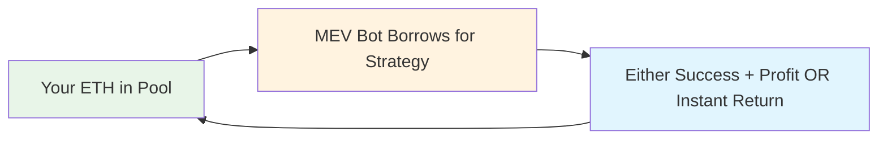
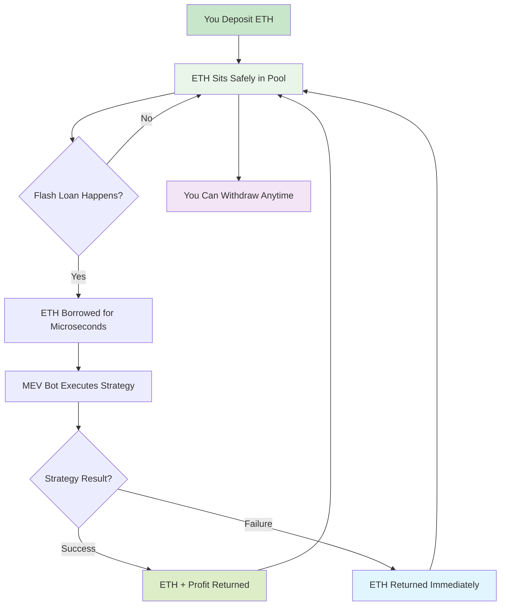
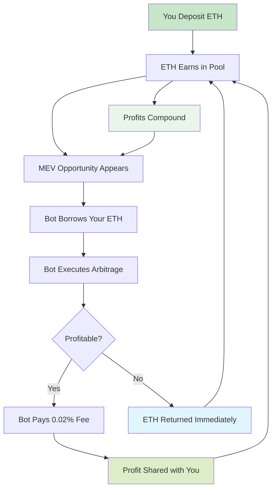
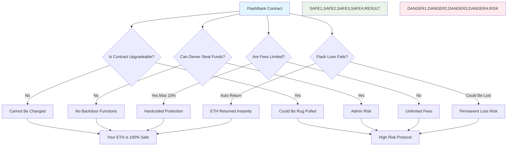
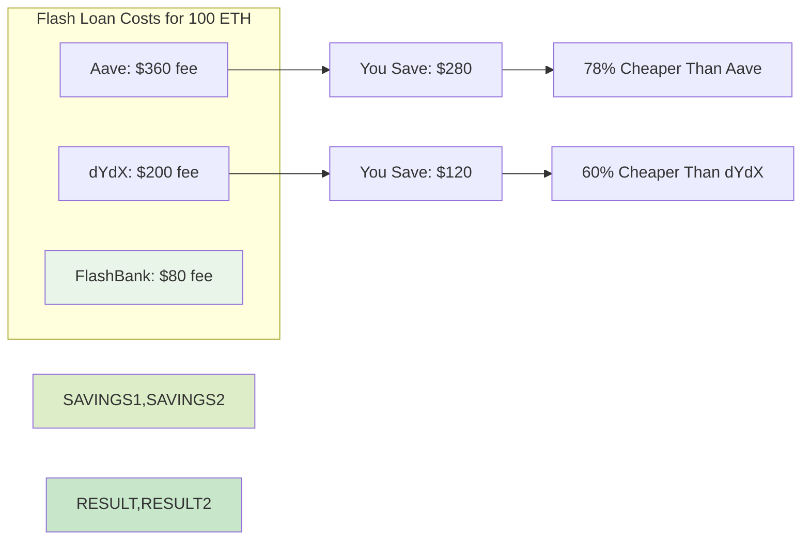
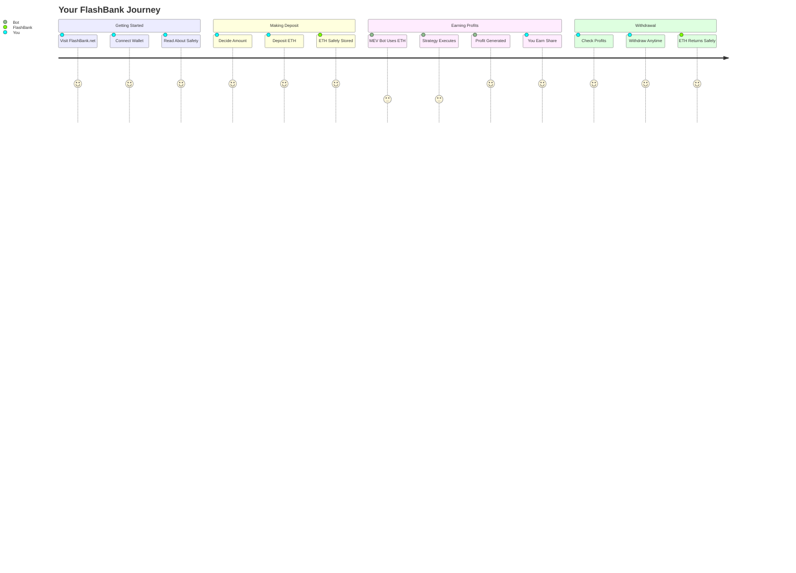
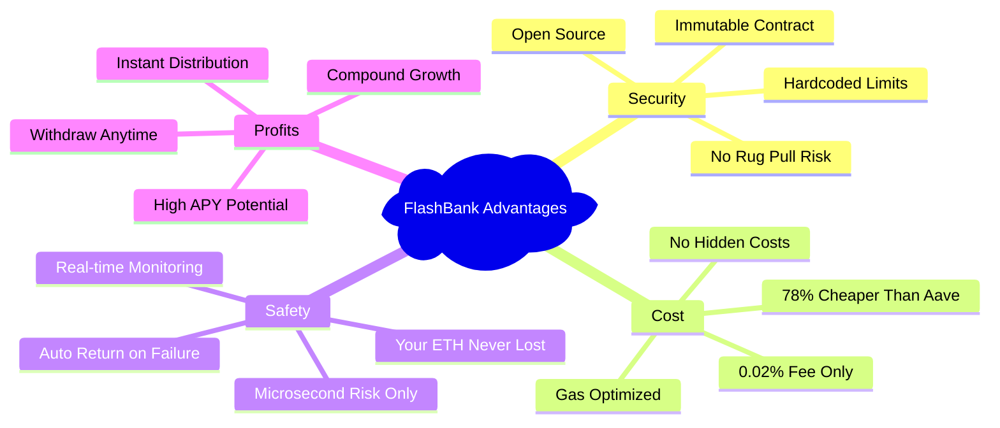

# FlashBank Flash Loan Concept - Simple Explanation

## 🏦 The Revolutionary Concept: Your ETH Never Leaves Your Account (Permanently)

Traditional DeFi protocols require you to **deposit and trust**. FlashBank uses **temporary custody** - your ETH is only borrowed for microseconds.

## ⚡ How Flash Loans Work in FlashBank

### Simple 3-Step Process

### The Safety Guarantee

## 🛡️ Zero Risk Explanation

### Traditional DeFi vs FlashBank

```mermaid
graph TB
    subgraph "Traditional DeFi Protocol"
        T1[Deposit ETH] --> T2[ETH Locked in Protocol]
        T2 --> T3[Protocol Controls Your ETH]
        T3 --> T4[Risk: Hacks, Rug Pulls, Bugs]
        T4 --> T5[Potential Loss: 100%]
    end
    
    subgraph "FlashBank Flash Loans"
        F1[Deposit ETH] --> F2[ETH in Immutable Pool]
        F2 --> F3[Borrowed for Microseconds Only]
        F3 --> F4[Automatic Return on Any Failure]
        F4 --> F5[Risk Window: Microseconds]
        F5 --> F6[Your ETH Always Returns]
    end
    
    style T1,T2,T3,T4,T5 fill:#ffebee
    style F1,F2,F3,F4,F5,F6 fill:#e8f5e8
```

## ⏱️ Time-Based Risk Comparison

### Where Your ETH Spends Time

```mermaid
gantt
    title ETH Risk Timeline Comparison
    dateFormat X
    axisFormat %s
    
    section Traditional DeFi
    Your ETH at Risk: 0, 365d
    
    section FlashBank
    Your ETH Safe: 0, 365d
    Flash Loan Risk: 100, 101
```

**Traditional DeFi**: Your ETH is at risk 24/7/365
**FlashBank**: Your ETH is only at risk for 0.0001% of the time

## 💰 The Flash Loan Profit Cycle

### How You Earn Money

## 🔒 Security Guarantee Flowchart

### Why Your ETH is Always Safe

## 📊 Simple Cost Comparison

### Why MEV Bots Choose FlashBank

## 🎯 User Journey: From Deposit to Profit

### Complete User Experience

## 🚀 Why FlashBank Wins

### The Perfect Storm

---

## 🔑 Key Takeaways

1. **🛡️ Your ETH stays safe** - only at risk for microseconds during flash loans
2. **💰 Earn passive income** - get paid when MEV bots use your ETH
3. **⚡ Zero permanent risk** - failed strategies return your ETH instantly
4. **🏆 Best rates** - 78% cheaper than Aave means more profits for you
5. **🔒 Immutable security** - contract cannot be changed or rug-pulled

**FlashBank: The safest way to earn yield in DeFi! 🚀**
