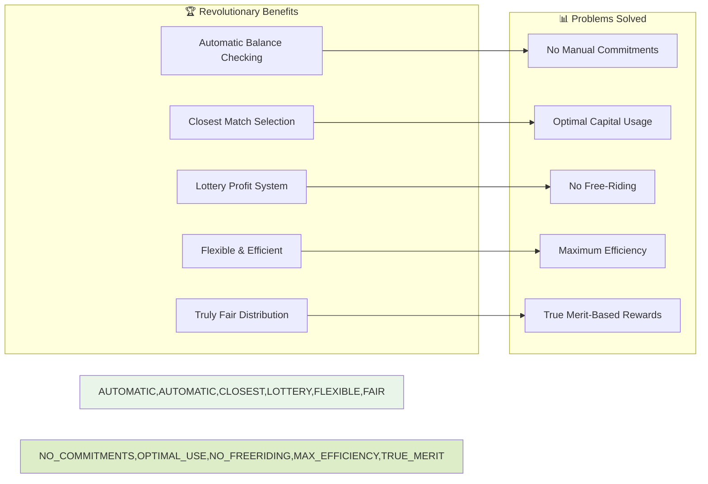
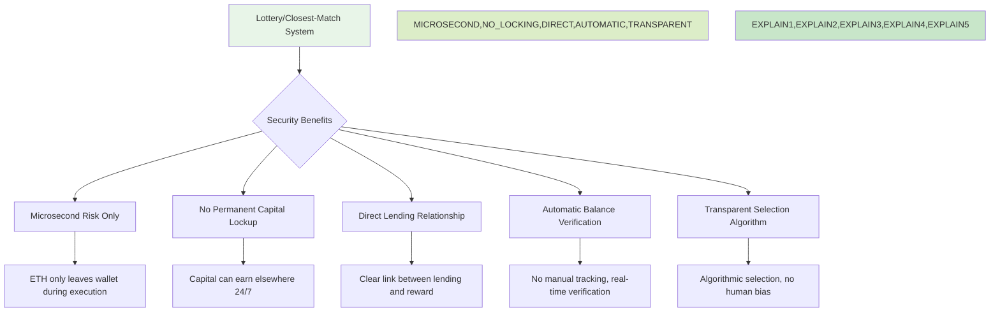

# FlashBank Pool Mechanics - How Your ETH Works

## ⚠️ **WARNING: This describes the TRADITIONAL deposit pool approach**

**🚨 The current contract uses a traditional deposit pool, but FlashBank should use a revolutionary "just-in-time" approval system where ETH stays in your wallet.**

**See [CORRECT_ARCHITECTURE.md](CORRECT_ARCHITECTURE.md) for the proper revolutionary design.**

---

## 🏊 Traditional Pool System (CURRENT - NEEDS FIXING)

## 🏦 Revolutionary FlashBank Pool Mechanics

### How the Just-in-Time System Actually Works

```mermaid
graph TD
    subgraph "👥 Users' Wallets (ETH Stays Here)"
        WALLET_A[Alice Wallet: 50 ETH]
        WALLET_B[Bob Wallet: 30 ETH]
        WALLET_C[Carol Wallet: 20 ETH]
        WALLET_D[Dave Wallet: 10 ETH]
    end

    subgraph "🏦 FlashBank Contract"
        APPROVALS[User Approvals]
        LIQUIDITY[Available Liquidity: 110 ETH]
        PROFITS[Profit Pool: 0.022 ETH]
    end

    subgraph "⚡ Flash Loan Execution"
        REQUEST[MEV Bot: Request 25 ETH]
        CHECK[Contract Checks User Balances]
        PULL[Pull from Closest Matches]
        LEND[Send 25 ETH to Bot]
        RETURN[Bot Returns 25.005 ETH]
        DISTRIBUTE[Distribute 0.005 ETH to LENT ETH]
    end

    subgraph "💰 Profit Distribution (Lottery System)"
        ALICE_PROFIT[Alice: 0.0025 ETH (50% of fee)]
        BOB_PROFIT[Bob: 0.0015 ETH (30% of fee)]
        CAROL_PROFIT[Carol: 0.001 ETH (20% of fee)]
        DAVE_PROFIT[Dave: 0 ETH (not lent)]
    end

    WALLET_A --> APPROVALS
    WALLET_B --> APPROVALS
    WALLET_C --> APPROVALS
    WALLET_D --> APPROVALS

    APPROVALS --> LIQUIDITY
    LIQUIDITY --> REQUEST
    REQUEST --> CHECK
    CHECK --> PULL
    PULL --> LEND
    LEND --> RETURN
    RETURN --> DISTRIBUTE

    DISTRIBUTE --> ALICE_PROFIT
    DISTRIBUTE --> BOB_PROFIT
    DISTRIBUTE --> CAROL_PROFIT
    DISTRIBUTE --> DAVE_PROFIT

    style WALLET_A,WALLET_B,WALLET_C,WALLET_D fill:#e8f5e8
    style APPROVALS,LIQUIDITY fill:#e1f5fe
    style PROFITS fill:#dcedc8
    style REQUEST,CHECK,PULL,LEND,RETURN,DISTRIBUTE fill:#fff3e0
    style ALICE_PROFIT,BOB_PROFIT,CAROL_PROFIT,DAVE_PROFIT fill:#c8e6c9
```

## 🔍 Key Revolutionary Features

### ✅ What Actually Happens
1. **ETH stays in user wallets** - never locked in contract
2. **Automatic balance checking** - contract checks user wallet balances in real-time
3. **Closest match selection** - pulls from accounts with ETH amounts closest to loan size
4. **Lottery profit system** - only ETH that gets lent receives profits
5. **Automatic returns** - ETH returned to wallets immediately after flash loan

### ❌ What Doesn't Happen
1. **No permanent deposits** - ETH never leaves wallet except during flash loan
2. **No proportional free-riding** - only lent ETH gets profits
3. **No complex commitments** - just approval limits, automatic checking
4. **No unnecessary locking** - capital can be used elsewhere

## 💡 Why This Revolutionary System is Brilliant

### The Lottery/Closest-Match System:



### 1. **Automatic Balance Checking** 🔍
- **Real-time wallet balance verification** - contract checks actual ETH in wallets
- **Approval limit tracking** - respects user's approved spending limits
- **Dynamic liquidity calculation** - total available changes as users spend elsewhere
- **No manual commitments needed** - just approve once, system handles the rest

### 2. **Closest Match Selection** 🎯
- **Pulls from accounts with ETH closest to loan size** - minimizes partial transfers
- **Reduces gas costs** - fewer transfers needed for same loan amount
- **Prevents fragmentation** - uses optimal sized chunks of ETH
- **Fair to all participants** - no bias toward large or small holders

### 3. **Lottery Profit System** 🎰
- **Only ETH that gets lent receives profits** - prevents free-riding
- **Direct relationship between lending and reward** - like traditional lending
- **Fair to small holders** - their ETH only gets lent when actually needed
- **Prevents whale exploitation** - large holders can't profit without lending

### 4. **Maximum Capital Efficiency** ⚡
- **ETH can earn elsewhere** - not locked in contract 24/7
- **Flexible participation** - users can use ETH for other strategies
- **Scalable to any size** - works with 1 ETH loans or 1000 ETH loans
- **Zero opportunity cost** - funds always available for best opportunities

## 📝 Real Revolutionary Example Walkthrough

### Initial State
```
User Wallets (ETH stays here):
- Alice: 50 ETH available, approved limit: 50 ETH
- Bob: 30 ETH available, approved limit: 30 ETH
- Carol: 20 ETH available, approved limit: 20 ETH
- Dave: 10 ETH available, approved limit: 10 ETH

Total Available Liquidity: 110 ETH
FlashBank Contract Balance: 0 ETH (only holds profits)
```

### Flash Loan Event - Closest Match Selection
```
MEV Bot requests: 25 ETH flash loan
Contract checks user wallets and finds:

Available ETH amounts: [50, 30, 20, 10]
Closest matches to 25 ETH: 30 ETH (Bob) and 20 ETH (Carol)

Contract pulls:
- Bob: 20 ETH (closest match for 25 ETH loan)
- Carol: 5 ETH (remaining needed)
- Total pulled: 25 ETH
```

### Strategy Execution
```
Contract sends: 25 ETH to MEV bot
MEV bot executes arbitrage strategy
MEV bot returns: 25.005 ETH (25 + 0.005 fee)
Contract calculates profit: 0.005 ETH
```

### Lottery Profit Distribution (Only Lent ETH Gets Profits)
```
Profit distribution based on WHOSE ETH was actually lent:

Bob's ETH lent: 20 ETH (80% of lent amount)
Carol's ETH lent: 5 ETH (20% of lent amount)
Alice's ETH lent: 0 ETH (0% - not used)
Dave's ETH lent: 0 ETH (0% - not used)

Profit Distribution:
- Bob: 0.005 × 80% = 0.004 ETH
- Carol: 0.005 × 20% = 0.001 ETH
- Alice: 0 ETH (ETH not lent)
- Dave: 0 ETH (ETH not lent)
```

### After Flash Loan
```
Contract returns ETH to original wallets:
- Bob's wallet: 30 ETH → 25 ETH lent + 20 ETH returned = 45 ETH + 0.004 ETH profit
- Carol's wallet: 20 ETH → 5 ETH lent + 15 ETH returned = 20 ETH + 0.001 ETH profit
- Alice's wallet: 50 ETH (unchanged)
- Dave's wallet: 10 ETH (unchanged)

FlashBank Contract Balance: 0.005 ETH (only profits)
```

## 🔐 Revolutionary Security Implications

### Why the Lottery/Closest-Match System is Safer



### 1. **Microsecond Risk Window** ⚡
- **ETH only at risk during flash loan execution** - not 24/7
- **Automatic failure recovery** - ETH returned even if strategy fails
- **No permanent exposure** - funds always under user control

### 2. **No Capital Lockup** 🔓
- **ETH can earn elsewhere** - participate in other DeFi strategies
- **Flexible participation** - users can adjust approval limits anytime
- **No opportunity cost** - funds always available for best opportunities

### 3. **Direct Lending Relationship** 🎯
- **Only lent ETH gets profits** - prevents free-riding
- **Clear incentive alignment** - users only profit when their ETH is used
- **Fair to all participants** - small and large holders treated equally

### 4. **Automatic Verification** 🔍
- **Real-time balance checking** - contract verifies wallet balances
- **Approval limit enforcement** - respects user's spending limits
- **No manual intervention** - completely algorithmic process

### 5. **Transparent Selection** 📊
- **Closest match algorithm** - mathematically optimal selection
- **No human bias** - pure algorithmic decision making
- **Verifiable on-chain** - all selection logic visible and auditable

## 🎯 Revolutionary Summary

### The Simple Revolutionary Answer:
> **Your ETH stays in your wallet earning elsewhere. FlashBank only pulls it temporarily during flash loans, using closest-match selection and lottery profit distribution where only lent ETH gets rewarded.**

### Why This Revolutionary System is Perfect:
- ✅ **Automatic** - Real-time balance checking, no manual commitments
- ✅ **Fair** - Only ETH that gets lent receives profits (no free-riding)
- ✅ **Efficient** - Closest match selection minimizes gas costs
- ✅ **Flexible** - ETH can earn elsewhere, adjust approvals anytime
- ✅ **Secure** - Microsecond risk, automatic returns, algorithmic selection
- ✅ **Scalable** - Works with 1 ETH loans or 1000 ETH loans from hundreds of users

**FlashBank's revolutionary just-in-time liquidity system is the most innovative and fair approach to flash loan liquidity in all of DeFi! 🚀💰**

### Key Differentiators:
1. **🏦 ETH stays in wallets** - Revolutionary capital efficiency
2. **🎯 Closest match selection** - Optimal ETH usage patterns
3. **🎰 Lottery profit system** - Only lent ETH gets rewarded
4. **⚡ Microsecond risk** - Maximum security with minimum exposure
5. **🔄 Automatic everything** - No manual intervention needed
